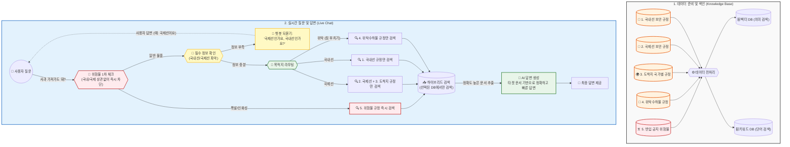

# Schema

```mermaid
graph TD
    %% ==========================================
    %% 1. 데이터 준비 (OFFLINE)
    %% ==========================================
    subgraph Data_Preparation ["1. 데이터 준비 및 색인 (Knowledge Base)"]
        style Data_Preparation fill:#f9f9f9,stroke:#333,stroke-width:2px
        
        Source1[("📘 1. 국내선 보안 규정")]
        Source2[("📕 2. 국제선 보안 규정")]
        Source3[("🌍 3. 도착지 국가별 규정")]
        Source4[("🧳 4. 위탁수하물 규정")]
        Source5[("☠️ 5. 반입 금지 위험물")]

        Processor{{"⚙️ 데이터 전처리"}}
        
        Source1 & Source2 & Source3 & Source4 & Source5 --> Processor
        
        VectorDB[("🗄️ 벡터 DB (의미 검색)")]
        KeywordDB[("🗄️ 키워드 DB (단어 검색)")]
        
        Processor --> VectorDB
        Processor --> KeywordDB
    end

    %% ==========================================
    %% 2. 실시간 질문 처리 (ONLINE)
    %% ==========================================
    subgraph User_Flow ["2. 실시간 질문 및 답변 (Live Chat)"]
        style User_Flow fill:#e3f2fd,stroke:#1565c0,stroke-width:2px
        
        User((👤 사용자 질문)) --> |"사과 가져가도 돼?"| Safety_Check
        
        %% 단계 0: 위험물 1차 필터링 (가장 빠름)
        Safety_Check{{"🚨 위험물 1차 체크<br>(국내/국제 상관없이 즉시 차단)"}}
        Safety_Check --> |"폭발/인화성"| Route_Danger[🔍 5. 위험물 규정 즉시 검색]
        Safety_Check --> |"일반 물품"| Context_Check
        
        %% 단계 1: 맥락 확인 및 되묻기 (새로 추가된 핵심 로직)
        Context_Check{{"🤔 필수 정보 확인<br>(국내선/국제선 파악)"}}
        Context_Check --> |"정보 부족"| Ask_User["💬 챗봇 되묻기:<br>'국제선인가요, 국내선인가요?'"]
        Ask_User -.-> |"사용자 답변 (예: 국제선이요)"| User
        
        Context_Check --> |"정보 충분"| Intent_Router
        
        %% 단계 2: 의도에 따른 타겟 라우팅 (검색 효율 극대화)
        Intent_Router{{"🧠 목적지 라우팅"}}
        
        Intent_Router --> |"국제선"| Route_Intl[🔍 2. 국제선 + 3. 도착지 규정만 검색]
        Intent_Router --> |"국내선"| Route_Dom[🔍 1. 국내선 규정만 검색]
        Intent_Router --> |"위탁 (짐 부치기)"| Route_Baggage[🔍 4. 위탁수하물 규정만 검색]
        
        %% 단계 3: 타겟팅된 검색 및 생성
        Route_Danger --> Retriever
        Route_Intl --> Retriever
        Route_Dom --> Retriever
        Route_Baggage --> Retriever
        
        Retriever[("📥 하이브리드 검색<br>(선택된 DB에서만 검색)")]
        
        Retriever --> |"정확도 높은 문서 추출"| LLM_Brain
        
        LLM_Brain["🤖 AI 답변 생성<br>타겟 문서 기반으로 정확하고 빠른 답변"]
        
        LLM_Brain --> Final_Answer[💬 최종 답변 제공]
    end

    %% 스타일링
    classDef sources fill:#fff3e0,stroke:#e65100,stroke-width:2px;
    classDef danger fill:#ffebee,stroke:#c62828,stroke-width:2px;
    classDef logic fill:#e8f5e9,stroke:#2e7d32,stroke-width:2px;
    classDef clarify fill:#fff9c4,stroke:#fbc02d,stroke-width:2px;
    
    class Source1,Source2,Source3,Source4 sources;
    class Source5,Route_Danger,Safety_Check danger;
    class Intent_Router,LLM_Brain logic;
    class Context_Check,Ask_User clarify;
```

